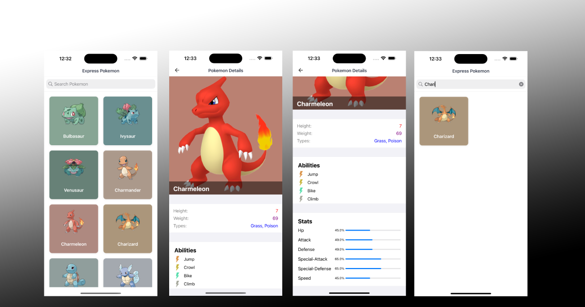

# Express Pokemon

This project Contains An iOS app designed using Clean Architecture, MVVM and Coordinator which is implemented with UIKit.

## Description of The App

Express Pokemon is a simple Pokemon app, built with UIKit and Combine framework, retrieved data from /v2 of the [pokéapi](https://pokeapi.co). This is a Conceptual project to present MVVM with UIKit, Combine + Clean approach.

## Concepts Used Here

- Core Data
- Clean Architecture
- MVVM
- Coordinator Pattern
- Dependency Injection
- Caching images (third-party library)
- SwiftLint
- UnitTest
- CocoaPods

## Third-party libraries

    pod 'SDWebImage', '~> 5.0'
    pod 'CocoaLumberjack/Swift'

    TESTS
    
    pod 'Quick'
    pod 'Nimble'
    pod 'Cuckoo'

## How to run

Express Pokemon requires iOS 14.0 or later.

- Open terminal and cd to project folder
- Run Pod install
- Find `ExpressPokemon.xcworkspace` in your workspace and open it

## API

- [pokéapi v2](https://pokeapi.co)

## Requirements

- iOS 14.0+
- Swift +5

## Features

- Display list of Pokemons
- Display Pokemon Details
- Load more items during scrolling (pagination)
- Cache images
- Cache Data (available even when offline) using CoreData
- Searching
- Ability to Adapt each item basing on it's color
- States (Loading, Empty, Error, Success)
- Logging

## More features to come

- UnitTests
- UITests
- Favorites
- Sorting
- DeepLinking to specific Pokemon Detail page
- Pull down to refresh
- Localization / Internationalization
- More animations

## Style and conventions - SwiftLint

A script runs when building the app that executes SwiftLint to enforce style & conventions to the code.

You can install SwiftLint with Homebrew: brew install swiftlint

Thank you!
